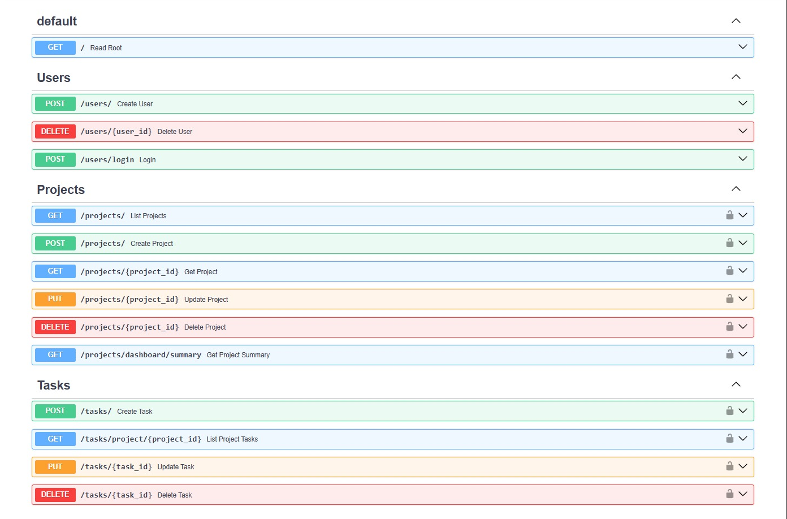
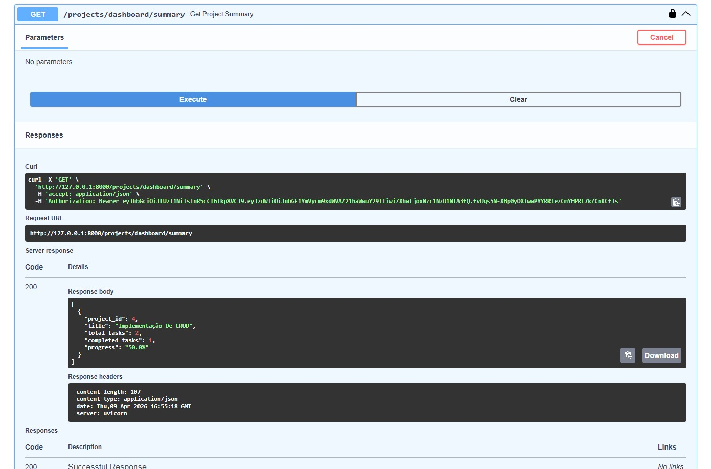
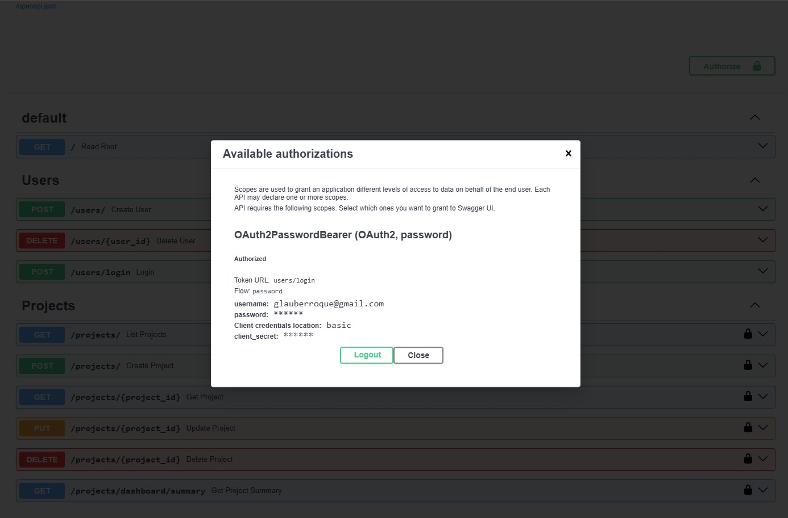
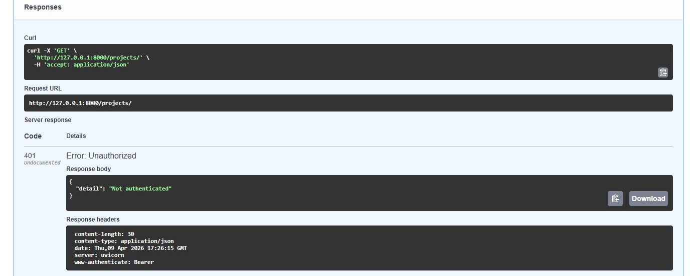
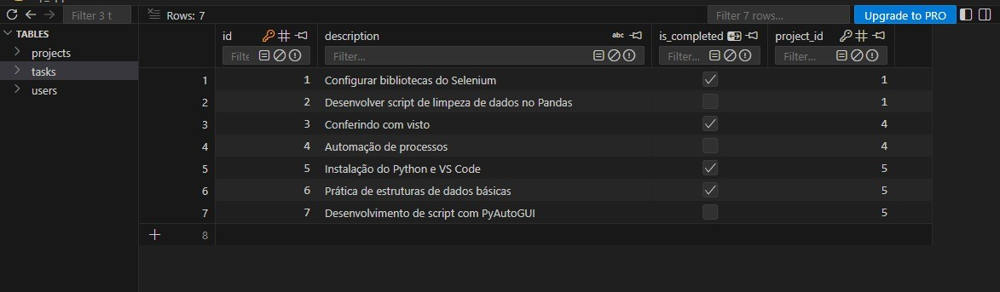
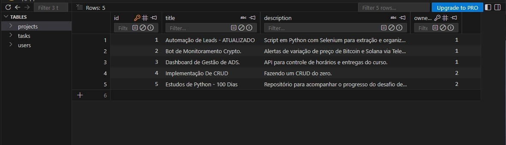

# TaskMaster API: Gestão Estruturada de Projetos e Performance

A **TaskMaster API** é uma solução de backend robusta desenvolvida para otimizar o fluxo de trabalho em ambientes corporativos e escritórios. Diferente de listas de tarefas simples, esta API foca na hierarquia de dados e na segurança, permitindo que gestores e colaboradores acompanhem o progresso real de entregas através de métricas automatizadas.

## 🛠️ Processo de Desenvolvimento

Este projeto foi executado seguindo uma metodologia de ciclo de vida de software, garantindo que cada funcionalidade atendesse a um requisito de negócio específico.

### 1. Definição do Produto (PDD)
O desenvolvimento iniciou com a criação de um documento de definição de produto, onde foram mapeados os problemas de gestão de produtividade e as soluções necessárias (CRUD de tarefas, métricas de progresso e segurança).

### 2. Modelagem Relacional
Estruturação do banco de dados focada em integridade. Definição das relações entre Usuários e Projetos (1:N) e Projetos e Tarefas (1:N), garantindo que a exclusão de um projeto remova automaticamente suas tarefas associadas (Cascade Delete).

### 3. Arquitetura e Segurança
Implementação da base da API com FastAPI e autenticação JWT. O foco foi garantir o isolamento de dados: cada usuário autenticado só pode visualizar e manipular seus próprios registros.

### 4. Lógica de Negócio e Métricas
Desenvolvimento do motor de cálculo de progresso. A API processa dinamicamente a relação entre tarefas totais e concluídas para fornecer um feedback visual de performance ao gestor.

### 5. Documentação e Qualidade
Finalização com documentação interativa via Swagger UI e estruturação do ambiente para fácil implantação via `requirements.txt`.

## 💼 Aplicação Prática e Valor de Negócio

Esta API foi desenhada para ser a "espinha dorsal" de ferramentas de produtividade. Algumas aplicações práticas incluem:

* **Escritórios de Advocacia/Contabilidade**: Gestão de processos (Projetos) e suas respectivas petições ou lançamentos (Tarefas), com isolamento total de dados entre consultores.
* **Agências de Marketing**: Acompanhamento de campanhas, onde cada cliente é um projeto e as peças criativas são as tarefas.
* **Automação de Processos (RPA)**: Pode servir como um "Orquestrador", onde robôs consultam a API para saber quais tarefas ainda precisam ser executadas e atualizam o status em tempo real.

## 🛠️ Diferenciais Técnicos (Arquitetura Profissional)

O projeto não foca apenas em funcionalidades, mas em **padrões de mercado**:

* **Segurança Corporativa**: Implementação de autenticação via **OAuth2 com JWT (JSON Web Tokens)**. Senhas nunca são salvas em texto puro; utilizamos **Hashing com Bcrypt**.
* **Isolamento de Dados (Multi-tenancy)**: Cada usuário autenticado possui sua própria camada de dados. Um usuário jamais terá acesso aos projetos ou tarefas de outro, garantindo privacidade e conformidade com a LGPD.
* **Métricas de Performance**: Rota de Dashboard que processa e entrega o percentual de conclusão de cada projeto em tempo real, facilitando a tomada de decisão.
* **Relacionamentos Relacionais**: Estrutura de banco de dados SQL com integridade referencial (Cascade Delete), garantindo que o banco de dados permaneça limpo e consistente.

## 📊 Demonstração do Sistema

Nesta seção, é apresentado o funcionamento visual da API e a validação da sua arquitetura robusta.

### 1. Interface de Documentação e Testes (Swagger UI)
A API utiliza o Swagger UI para fornecer uma documentação viva e interativa. Note os ícones de "cadeado" ao lado dos endpoints protegidos, indicando a necessidade de autenticação Bearer Token (JWT) para acesso.
(Todos os exemplos usados na imagem são fictícios, feitos para os testes.)

### 2. Camada de Segurança e Autenticação
Abaixo, demonstramos o fluxo de autenticação. A API valida as credenciais do usuário e emite um token JWT seguro, que deve ser utilizado nas requisições subsequentes para garantir que o utilizador aceda apenas aos seus próprios dados.

### 3. Persistência e Integridade de Dados (SQLite)
Demonstração da estrutura do banco de dados SQLite. A API garante que as relações entre Utilizadores, Projetos e Tarefas sejam mantidas com integridade, permitindo a rastreabilidade e a consistência da informação.

## 🚀 Como colocar em Produção

Esta API está pronta para ser containerizada e hospedada. Sugestão de Workflow:

1.  **Dockerização**: Criar um `Dockerfile` para empacotar a aplicação.
2.  **Hospedagem**: Pode ser implantada em serviços como **Render, Railway ou AWS App Runner**.
3.  **Banco de Dados**: Migração do SQLite para **PostgreSQL** (apenas alterando a string de conexão no `database.py`).
4.  **Servidor Web**: Uso do **Gunicorn** com workers Uvicorn para alta disponibilidade em produção.

## 🛠️ Tecnologias Utilizadas

* **Python 3.13+**
* **FastAPI** (Framework de alta performance)
* **SQLAlchemy** (ORM para manipulação de banco de dados)
* **Pydantic** (Validação de dados e Schemas)
* **Passlib & Python-Jose** (Criptografia e Segurança)

## 🚀 Evolução e Escalabilidade (Roadmap)

A arquitetura deste projeto foi projetada para suportar o crescimento orgânico de uma equipe. Uma evolução natural planejada é a implementação de **RBAC (Role-Based Access Control)**.

**Como seria implementado:**
1.  **Atribuição de Cargos**: Adição de uma coluna `role` (ex: `admin`, `user`) na tabela de usuários.
2.  **Lógica de Hierarquia**: A função de segurança `get_current_user` passaria a validar se o usuário é o dono do registro **OU** se possui o cargo de `admin`.

Isso permitiria que líderes de equipe (como sócios de escritórios) tivessem uma visão global de todos os projetos para monitorar prazos e gargalos, enquanto os colaboradores manteriam a privacidade total de seus fluxos individuais.

---
*Feito por Tayaga Rayanne!*
*Este é um projeto pessoal focado em demonstrar competências de arquitetura de software, segurança de dados e desenvolvimento de APIs escaláveis.*